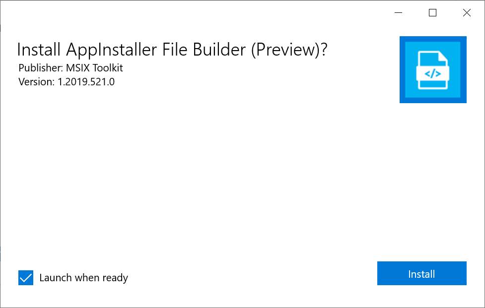
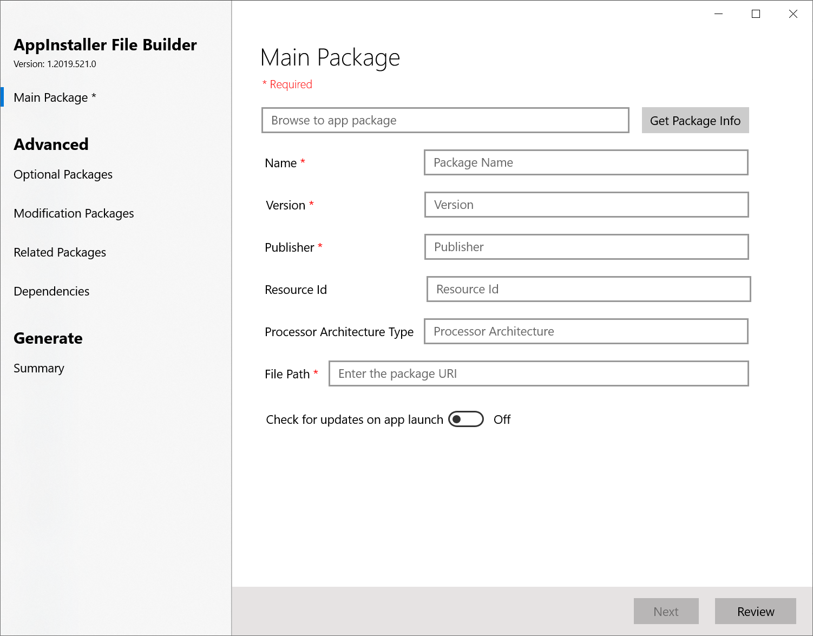

# AppInstaller File Builder

AppInstaller File Builder is a Windows 10 applications for users to easily build an AppInstaller file. Currently the process of building an AppInstaller file can be error ridden. The app makes this easier by allowing the users to specify the app packages that they would like to distribute, along with the update options.

## Install the app 

[Click here](https://github.com/microsoft/MSIX-Toolkit/releases/download/v1.1/AppInstallerFileBuilder_1.2019.524.0_x86.appx) to download the app package and use App Installer to install it:

## Use 

**Step 1:** Install and launch the app 

**Step 2:** Browse to the app package that you would like to install using the AppInstaller file 

**Step 3:** Specify the update options that you would like the app package to have

**Step 4:** Follow the flow to add optional packages, modification packages or framework dependencies as part of the AppInstaller file

**Step 5:** At any time, you can click on ***Review*** to view the current state of the AppInstaller file and if you are satisfied with it, click on ***Generate*** to generate the AppInstaller file. 

## Contribute 

This is an open source app project. We welcome any contributions to the app whether it be suggestions or PR's. 
